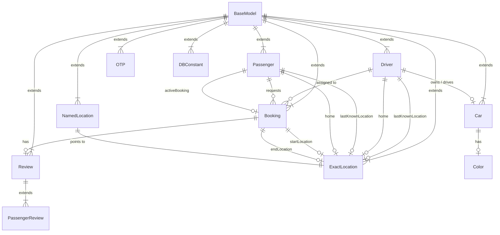

# 🚖 UberProject-EntityService

[](https://www.oracle.com/java/)
[](https://spring.io/projects/spring-boot)
[](https://spring.io/projects/spring-data-jpa)
[](https://flywaydb.org/)
[](https://www.mysql.com/)
[](https://gradle.org/)

**UberProject-EntityService** serves as the centralized domain modeling, entity persistence, and schema management service / shared library in the Uber backend microservices ecosystem. It defines JPA entities, enums, relationship mappings, database auditing, and incremental Flyway database migrations shared across services (e.g., Booking Service, Driver Service, Passenger Service, Location Tracking, and Review Service).

---

## 📌 Table of Contents

- [Architectural Overview](#-architectural-overview)
- [Key Features](#-key-features)
- [Tech Stack](#-tech-stack)
- [Domain Entity Model](#-domain-entity-model)
  - [Entity Relationship Diagram](#entity-relationship-diagram)
  - [Entities Summary](#entities-summary)
- [Database Migrations (Flyway)](#-database-migrations-flyway)
- [Project Structure](#-project-structure)
- [Getting Started](#-getting-started)
  - [Prerequisites](#prerequisites)
  - [Configuration](#configuration)
  - [Build and Run](#build-and-run)
  - [Publishing as a Library](#publishing-as-a-library)
- [Best Practices Implemented](#-best-practices-implemented)

---

## 🏗 Architectural Overview

In a distributed microservice architecture, keeping domain entity definitions and database schemas consistent is critical. **UberProject-EntityService** provides:

1. **Single Source of Truth**: Centralized definitions for core business entities (`Booking`, `Driver`, `Passenger`, `Car`, `Review`, `Location`, `OTP`).
2. **Schema Evolution Management**: Systematic, version-controlled database schema migrations managed with Flyway (`V1` to `V7`).
3. **Optimistic Locking & Concurrency Control**: Hibernate `@Version` locking in `Booking` to prevent race conditions during concurrent ride state updates.
4. **Publishable Artifact**: Integrated with Gradle `maven-publish` to allow publishing to local or remote Maven repositories for consumption by peer microservices.

---

## ✨ Key Features

- **JPA Auditing**: Automatic tracking of creation (`createdAt`) and update (`updatedAt`) timestamps across all entities via `AuditingEntityListener`.
- **Inheritance Mapping**: Joined table inheritance strategy (`InheritanceType.JOINED`) for polymorphic reviews (`Review` &rarr; `PassengerReview`).
- **Geospatial & Address Modeling**: Normalized `ExactLocation` (latitude/longitude coordinates) and `NamedLocation` (street address, city, state, country, zip).
- **Validation & Constraints**: Declarative validation using Jakarta Bean Validation (`@DecimalMin`, `@DecimalMax` for ratings, unique constraints on license plates and driver licenses).
- **OTP Generation & Verification**: Built-in helper utility to create numeric OTP verification instances for ride handoffs.
- **Dynamic Configuration**: `DBConstant` key-value entity for dynamic runtime settings.

---

## 🛠 Tech Stack

| Technology | Purpose |
| :--- | :--- |
| **Java 21** | Target runtime and modern language features |
| **Spring Boot 4.0.1** | Core application and dependency injection framework |
| **Spring Data JPA / Hibernate** | Object-relational mapping (ORM) and persistence |
| **Flyway (Core + MySQL)** | Automated, versioned database migrations |
| **MySQL 8.x** | Relational database storage |
| **Lombok** | Boilerplate code reduction (getters, setters, builders) |
| **Jakarta Bean Validation** | Data integrity and validation rules |
| **Gradle** | Build automation and Maven artifact publishing |

---

## 📊 Domain Entity Model

### Entity Relationship Diagram



### Entities Summary

- **`BaseModel`**: Abstract superclass with `@Id` (auto-increment), `@CreatedDate`, and `@LastModifiedDate`.
- **`Booking`**: Tracks ride lifecycle status (`SCHEDULED`, `CANCELLED`, `CAB_ARRIVED`, `ASSIGNING_DRIVER`, `IN_RIDE`, `COMPLETED`), start/end times, total distance, assigned `Driver`, requesting `Passenger`, pick-up & drop coordinates (`startLocation`, `endLocation`), and optimistic concurrency `@Version`.
- **`Driver`**: Driver credentials (`licenseNumber`, `aadharCard`, `phoneNumber`), approval status (`PENDING`, `APPROVED`, `REJECTED`), availability flag, rating (`0.00` to `5.00`), active city, assigned vehicle (`Car`), home/live locations, and booking history.
- **`Passenger`**: Rider profile (`name`, `email`, `phoneNumber`, `password`), active booking pointer, rating, home/live locations, and booking history.
- **`Car`**: Vehicle profile (`plateNumber`, `brand`, `model`, `CarType` [e.g., `XL`, `SEDAN`, `HATCHBACK`, `COMPACT_SUV`, `SUV`]), linked `Color`, and `Driver`.
- **`Review` & `PassengerReview`**: Polymorphic review mechanism (`booking_review` joined to `passenger_review`) recording review comments and numerical ratings per ride.
- **`ExactLocation` & `NamedLocation`**: Precise coordinates (`latitude`, `longitude`) with optional structured naming (`city`, `state`, `zipCode`, `country`).
- **`OTP`**: One-time passcodes generated for ride initiation or authentication.
- **`DBConstant`**: Key-value pairs for configurable database-level constants.

---

## 🗄 Database Migrations (Flyway)

The database schema is managed incrementally through Flyway SQL scripts located in `src/main/resources/db/migration/`:

| Version | Migration Script | Description |
| :--- | :--- | :--- |
| **V1** | `V1__init_db.sql` | Initial schema: creates `booking`, `driver`, `passenger`, `booking_review`, and `passenger_review` tables with constraints and foreign keys. |
| **V2** | `V2__add_car.sql` | Adds `car` and `color` tables with relationships to drivers. |
| **V3** | `V3__add_db_constants.sql` | Introduces the `dbconstant` table for dynamic system parameters. |
| **V4** | `V4__add_location_and_otp.sql` | Adds `exact_location`, `named_location`, and `otp` tables. |
| **V5** | `V5__add_rating.sql` | Adds rating fields and constraints to driver and passenger records. |
| **V6** | `V6__add_more_details_to_passenger.sql` | Enhances passenger schema with `active_booking_id`, `home_id`, and `last_known_location_id`. |
| **V7** | `V7__add_Version_in_Booking.sql` | Adds `version` column to `booking` table for optimistic locking. |

---

## 📂 Project Structure

```text
UberProject-EntityService/
├── gradle/wrapper/                 # Gradle Wrapper scripts and binaries
├── src/
│   ├── main/
│   │   ├── java/com/example/uberprojectentityservice/
│   │   │   ├── models/             # JPA domain entities and enums
│   │   │   │   ├── BaseModel.java
│   │   │   │   ├── Booking.java
│   │   │   │   ├── BookingStatus.java
│   │   │   │   ├── Car.java
│   │   │   │   ├── CarType.java
│   │   │   │   ├── Color.java
│   │   │   │   ├── DBConstant.java
│   │   │   │   ├── Driver.java
│   │   │   │   ├── DriverApprovalStatus.java
│   │   │   │   ├── ExactLocation.java
│   │   │   │   ├── NamedLocation.java
│   │   │   │   ├── OTP.java
│   │   │   │   ├── Passenger.java
│   │   │   │   ├── PassengerReview.java
│   │   │   │   └── Review.java
│   │   │   └── UberProjectEntityServiceApplication.java
│   │   └── resources/
│   │       ├── db/migration/       # Flyway database migration scripts
│   │       │   ├── V1__init_db.sql
│   │       │   ├── V2__add_car.sql
│   │       │   ├── V3__add_db_constants.sql
│   │       │   ├── V4__add_location_and_otp.sql
│   │       │   ├── V5__add_rating.sql
│   │       │   ├── V6__add_more_details_to_passenger.sql
│   │       │   └── V7__add_Version_in_Booking.sql
│   │       └── application.properties
│   └── test/                       # Unit and integration test suites
├── build.gradle                    # Gradle dependencies & publishing configuration
├── settings.gradle                 # Project settings
└── README.md                       # Project documentation
```

---

## 🚀 Getting Started

### Prerequisites

- **Java JDK 21** or higher
- **MySQL 8.0+** running locally or via Docker
- **Gradle 8.x** (or use included `./gradlew`)

### Configuration

Ensure your MySQL instance is running and create the database:

```sql
CREATE DATABASE Uber_Db_local;
```

Update your connection credentials in `src/main/resources/application.properties` if needed:

```properties
spring.datasource.url=jdbc:mysql://localhost:3306/Uber_Db_local
spring.datasource.username=your_mysql_user
spring.datasource.password=your_mysql_password

spring.jpa.hibernate.ddl-auto=validate
spring.flyway.enabled=true
spring.flyway.baseline-on-migrate=true
```

### Build and Run

1. **Build the project and run migrations**:
   ```bash
   ./gradlew clean build
   ```
   *(On Windows PowerShell: `.\gradlew.bat clean build`)*

2. **Run the Spring Boot application**:
   ```bash
   ./gradlew bootRun
   ```

### Publishing as a Library

To publish the entity service artifact to a local Maven repository (`~/.m2/repository`) so other microservices in your workspace can depend on it:

```bash
./gradlew publishToMavenLocal
```

To publish to the configured custom directory/repository:

```bash
./gradlew publish
```

---

## 💡 Best Practices Implemented

- **Schema Validation Over Generation**: Uses `spring.jpa.hibernate.ddl-auto=validate` alongside Flyway to avoid unchecked runtime DDL alterations.
- **Fetch Strategies**: Lazy loading by default on collection relationships (`FetchType.LAZY`) with Hibernate `@Fetch(FetchMode.SUBSELECT)` optimization on driver bookings.
- **Jackson Serialization Safeguards**: Annotated with `@JsonIgnoreProperties` on entity associations (`hibernateLazyInitializer`, `handler`) to prevent infinite recursion during JSON serialization.
- **Optimistic Concurrency**: Prevents race conditions during simultaneous booking updates using JPA `@Version`.
